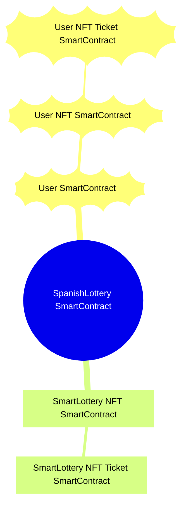
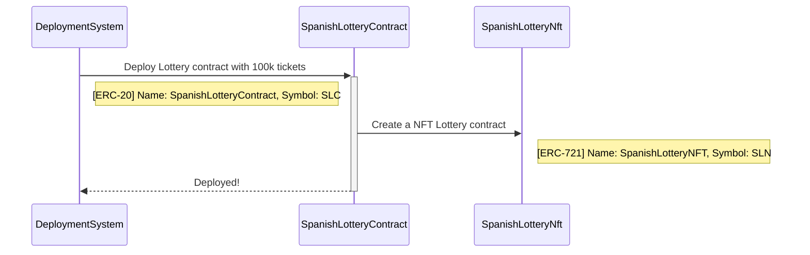
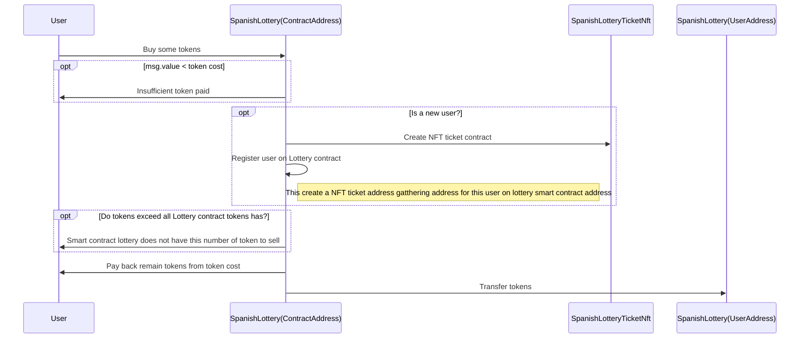
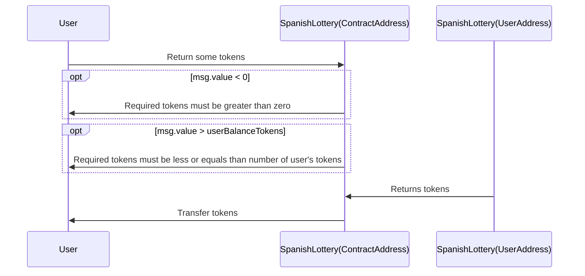
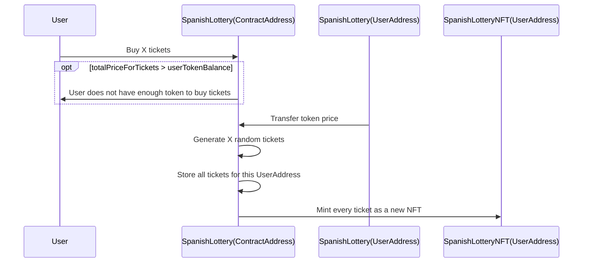
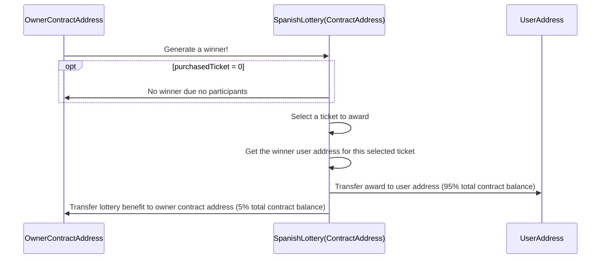

# Lottery - DApp

Decentralized application (DApp) to manage a Spanish lottery system using ERC20 & ERC721 tokens.

## Use cases
This DApp has the following use cases:

- Deploy a Spanish Lottery Smart Contract.
- Buy Spanish Lottery tokens.
- Returns Spanish Lottery tokens.
- Buy Spanish Lottery NFT tickets.
- Generate a winner.

### Deploy a Spanish Lottery Smart Contract

### Buy Spanish Lottery tokens [ERC-20]

### Returns Spanish Lottery tokens [ERC-20]

### Buy Spanish Lottery NFT tickets [ERC-721]

### Generate a winner [ERC-20]

> [!NOTE]
> All resources come from this [Udemy course](https://www.udemy.com/course/bootcamp-blockchain-cero-experto), specially 16th section: Lottery using ERC-20 & ERC-721 by [Joan Amengual](https://github.com/joaneeet7).
